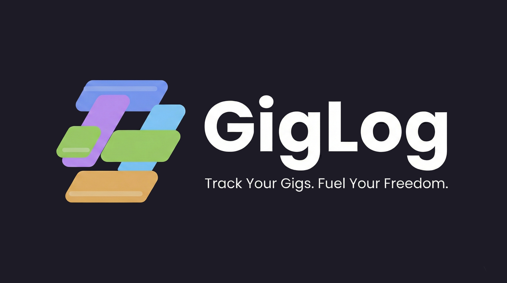
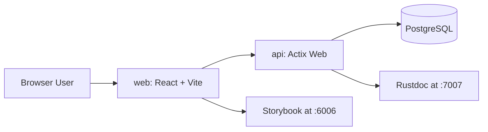

# GigLog




GigLog is a full-stack app for freelancers who need one place to track work, payments, and clients.

This repo highlights production-minded full-stack engineering across product, API design, testing, and developer experience.

## What GigLog Helps You Do

- Manage companies and jobs in one place
- Track work sessions and time-based earnings
- Record payouts and payment history
- Keep development and product documentation close to the codebase with Rustdoc and Storybook

## Recruiter Snapshot

- **Problem solved** - Reduces admin overhead for freelancers managing multiple clients and pay models
- **End-to-end ownership** - Delivers both product UI (`web/`) and backend domain/API implementation (`api/`)
- **Engineering quality** - Enforces lint/build/test gates in CI for both layers
- **Developer experience** - Uses reproducible local workflows via `just`, Docker, and documented scripts
- **Documentation quality** - Keeps visual docs (Storybook) and backend docs (Rustdoc) in the dev workflow

## Table of Contents

- [Overview](#overview)
- [Tech Stack](#tech-stack)
- [Architecture](#architecture)
- [Key Technical Decisions](#key-technical-decisions)
- [Demo Walkthrough](#demo-walkthrough)
- [Quick Start](#quick-start)
  - [Prerequisites](#prerequisites)
  - [One-Time Setup](#one-time-setup)
  - [Run Locally](#run-locally)
  - [Configuration Notes](#configuration-notes)
- [Local URLs](#local-urls)
- [Testing and Quality](#testing-and-quality)
- [Scripts Reference](#scripts-reference)
  - [API Scripts](#api-scripts)
  - [Web Scripts](#web-scripts)
  - [Database Scripts](#database-scripts)
  - [Utility Scripts](#utility-scripts)
- [Project Structure](#project-structure)
- [Troubleshooting](#troubleshooting)
- [What I'd Build Next](#what-id-build-next)
- [Contributing](#contributing)

## Overview

GigLog reduces admin overhead by combining job tracking, work logging, and payment tracking in one workflow. The project uses a Rust API (`api/`), a React frontend (`web/`), and PostgreSQL.

Engineering focus areas: typed API contracts, clear module boundaries, deterministic tests, and maintainable local tooling.

## Tech Stack

- **Frontend** - [React](https://react.dev), [TypeScript](https://www.typescriptlang.org), [Vite](https://vite.dev), [TanStack Router](https://tanstack.com/router/latest)
- **Backend** - [Rust](https://www.rust-lang.org) with [Actix Web](https://actix.rs)
- **Database** - [PostgreSQL](https://www.postgresql.org) with [SQLx](https://github.com/launchbadge/sqlx)
- **Styling** - [Sass](https://sass-lang.com) (SCSS modules + shared variables/mixins)
- **Documentation and UI Testing** - [Storybook](https://storybook.js.org)

## Architecture



## Key Technical Decisions

- **Rust API with Actix Web** - Prioritizes performance, explicit typing, and predictable errors
- **SQLx with PostgreSQL** - Uses compile-time checked queries for safer database interactions
- **TanStack Router + React + TypeScript** - Encourages route-level structure with strong type safety in the UI layer
- **Storybook-first UI documentation** - Keeps UI behavior and visual docs close to implementation
- **Task runner via `just`** - Standardizes local workflows and lowers setup friction
- **Docker-backed local database** - Keeps development environments consistent without external DB setup

## Demo Walkthrough

Use this flow in a portfolio review:

1. Start services with `just api` and `just web`
2. Open the app at <http://localhost:3000>
3. Sign up or log in
4. Add a company and create a job
5. Log a work session and record a payout
6. Open Storybook at <http://localhost:6006> for documented UI states
7. Open Rustdoc at <http://localhost:7007> for backend module and API docs

To showcase implementation quality, run `just web-test` and `cd api && cargo test` before or during the walkthrough.

## Quick Start

### Prerequisites

Required:

- [Node.js](https://nodejs.org)
- [pnpm](https://pnpm.io)
- [Rust](https://www.rust-lang.org)
- [Docker](https://www.docker.com)
- [Python 3](https://www.python.org/downloads/)
- [just](https://github.com/casey/just)
- [cargo-watch](https://github.com/watchexec/cargo-watch)

Optional (needed for manual migration workflows):

- [sqlx-cli](https://github.com/launchbadge/sqlx/tree/main/sqlx-cli)

### One-Time Setup

```sh
git clone https://github.com/joegoggin/gig-log.git
cd gig-log
docker compose up -d postgres
cp api/.env.example api/.env
pnpm --dir web install
```

### Run Locally

In separate terminals:

```sh
just api
```

```sh
just web
```

### Configuration Notes

- `api/.env.example` includes default local-development logging options
- To run migrations manually, use `just db-migrate`
- When unset, startup migrations and Docker auto-start are disabled by default
- In `api/.env`, set `AUTO_APPLY_MIGRATIONS_ENABLED=false` and/or `DOCKER_COMPOSE_AUTO_START_ENABLED=false` for manual control

## Local URLs

- App: <http://localhost:3000>
- Storybook: <http://localhost:6006>
- API docs (Rustdoc): <http://localhost:7007>

## Testing and Quality

CI runs lint, build, and test checks for API and web on each push via `.github/workflows/ci.yml`.

Common local checks:

- `just web-lint` - Lint frontend code
- `just web-test` - Run frontend test suite
- `just api-build` - Build API locally
- `cd api && cargo clippy -- -D warnings` - Lint API with strict warnings
- `cd api && cargo test` - Run API tests

Quality goals in this repository:

- Keep API and web changes covered by automated tests
- Catch regressions early through linting and CI checks
- Keep docs close to implementation for faster onboarding

## Scripts Reference

All project scripts are defined in `justfile`.

### API Scripts

| Command | Purpose |
| --- | --- |
| `just api` | Run API dev server (hot reload) and Rustdoc server |
| `just api-add <package>` | Add a Rust dependency in `api/` |
| `just api-remove <package>` | Remove a Rust dependency from `api/` |
| `just api-clean` | Clean API build artifacts |
| `just api-build` | Build the API |
| `just api-release` | Run the API in release mode |

### Web Scripts

| Command | Purpose |
| --- | --- |
| `just web` | Run Vite app and Storybook in parallel |
| `just web-add <package>` | Add a web dependency in `web/` |
| `just web-remove <package>` | Remove a web dependency from `web/` |
| `just web-build` | Build web app for production |
| `just web-preview` | Preview production web build |
| `just web-test` | Run web tests |
| `just web-lint` | Lint web code |
| `just web-format` | Format web code |
| `just web-check` | Run formatter write + eslint fix |
| `just web-storybook` | Run Storybook only |

### Database Scripts

| Command | Purpose |
| --- | --- |
| `just db-migrate` | Run SQLx database migrations |

### Utility Scripts

| Command | Purpose |
| --- | --- |
| `just posting` | Open [Posting](https://github.com/darrenburns/posting) with project collection |

## Project Structure

```text
.
|- api/                  # Rust API service
|- web/                  # React frontend and Storybook
|- docker/               # Docker-related assets
|- .github/workflows/    # CI workflows
|- docker-compose.yaml   # Local PostgreSQL and service orchestration
`- justfile              # Project task runner commands
```

## Troubleshooting

- Port already in use: stop existing processes on `3000`, `6006`, `7007`, or `5432`
- Database connection errors: confirm `docker compose up -d postgres` is running and `DATABASE_URL` is correct in `api/.env`
- Missing command errors: verify required tooling is installed (`just`, `pnpm`, `cargo-watch`, `sqlx-cli` if used)

## What I'd Build Next

- Add reporting dashboards for weekly/monthly earnings and client-level profitability
- Add export workflows (CSV and tax-oriented summaries) for end-of-year bookkeeping
- Add recurring job/session templates to speed up repeated admin actions
- Add role-based collaboration for freelancers and assistants/bookkeepers
- Expand observability with structured metrics and request tracing dashboards

## Contributing

1. Create a feature branch from `main`
2. Keep changes focused and well-scoped
3. Run relevant checks before opening a PR
4. Open a PR with context, implementation notes, and testing details

For UI and component documentation changes, include Storybook stories alongside code updates.
