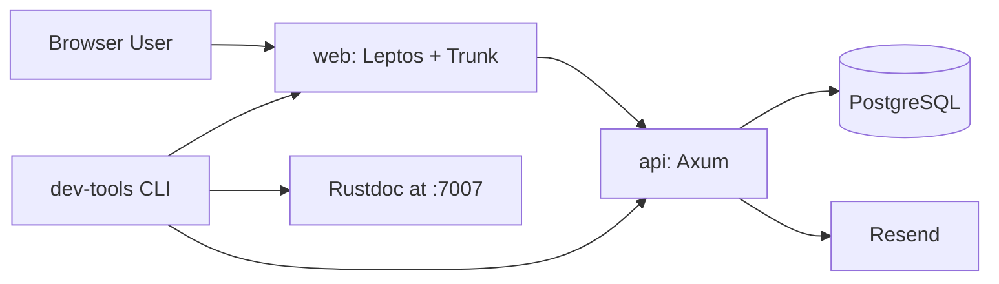

# GigLog

GigLog starts from a reality most freelancers know firsthand: the work is rewarding, but the admin can be exhausting. Between multiple clients, overlapping projects, different pay structures, and day-to-day life, it becomes easy to lose time to manual tracking. Hours live in one place, payouts in another, and job details end up scattered across notes or spreadsheets. That context switching creates stress and makes it harder to feel fully in control of your business.

This repository is the Rust rewrite of the original GigLog implementation. It keeps the same product goal while rebuilding the stack around a Rust workspace with a dedicated API crate (`api/`), frontend crate (`web/`), shared model crate (`common/`), and local developer tooling crate (`dev-tools/`).

The current focus is strong foundations: typed shared models, a production-minded authentication flow, consistent local tooling, and documentation-oriented workflows.

## What GigLog Helps You Do

- Manage companies and jobs in one place.
- Track work sessions and time-based earnings.
- Record payouts and payment history.

## At a Glance

- **Problem solved** - Reduces admin overhead for freelancers balancing multiple clients and payment models.
- **Rewrite goal** - Rebuilds GigLog as a Rust-first workspace while preserving product direction.
- **Current scope** - Delivers complete authentication/account flows plus health and infrastructure foundations.
- **Developer experience** - Uses reproducible local workflows through `just`, Docker, and workspace tooling.
- **Shared contracts** - Keeps frontend/backend models aligned through the `gig-log-common` crate.

## Table of Contents

- [Overview](#overview)
- [Active Development Status](#active-development-status)
- [Tech Stack](#tech-stack)
- [Architecture](#architecture)
- [Key Technical Decisions](#key-technical-decisions)
- [Demo Walkthrough](#demo-walkthrough)
- [Quick Start](#quick-start)
  - [Prerequisites](#prerequisites)
  - [One-Time Setup](#one-time-setup)
  - [Run Locally](#run-locally)
  - [Configuration Notes](#configuration-notes)
- [Local URLs](#local-urls)
- [Testing and Quality](#testing-and-quality)
- [Scripts Reference](#scripts-reference)
  - [API Scripts](#api-scripts)
  - [Web Scripts](#web-scripts)
  - [Common Scripts](#common-scripts)
  - [Database Scripts](#database-scripts)
  - [Development Scripts](#development-scripts)
- [Project Structure](#project-structure)
- [Troubleshooting](#troubleshooting)
- [Contributing](#contributing)

## Overview

GigLog is being rewritten as a Rust workspace that combines authentication, future domain tracking workflows (companies/jobs/payments/work sessions), and internal developer tooling in one codebase.

Current architecture centers on an Axum API (`api/`), a Leptos CSR frontend (`web/`), PostgreSQL, and a shared `common/` crate for models and validation.

## Active Development Status

GigLog rewrite is in active development.

### Completed

- [x] Workspace foundation (`api/`, `web/`, `common/`, `dev-tools/`).
- [x] Authentication API flow (`/auth/sign-up`, `/auth/confirm-email`, `/auth/log-in`, `/auth/log-out`, `/auth/refresh`, `/auth/me`, forgot-password, password change, email change).
- [x] Health endpoint (`GET /health`).
- [x] Frontend auth pages and protected-route guard.
- [x] Shared domain model contracts in `gig-log-common`.
- [x] Initial SQLx migrations for users, companies, jobs, work sessions, payments, auth codes, refresh tokens, and appearance tables.
- [x] Local development tooling (`dev`, `docs`, `setup`, API tester, DB viewer).

### In Progress / Planned

- [ ] Domain CRUD APIs beyond auth/health (companies, jobs, payments, work sessions).
- [ ] Full frontend workflows for dashboard, companies, jobs, payments, and settings pages (currently scaffolded placeholders).
- [ ] Expanded automated test coverage for end-to-end domain flows.
- [ ] CI workflow alignment with rewrite-era quality gates.

## Tech Stack

- **Frontend** - [Leptos](https://leptos.dev) (CSR), [Trunk](https://trunkrs.dev), [Sass](https://sass-lang.com).
- **Backend** - [Rust](https://www.rust-lang.org) with [Axum](https://github.com/tokio-rs/axum).
- **Database** - [PostgreSQL](https://www.postgresql.org) with [SQLx](https://github.com/launchbadge/sqlx).
- **Shared contracts** - `gig-log-common` crate for shared models/validators.
- **Developer tooling** - Custom `gig-log-dev-tools` CLI (dev orchestrator, rustdoc indexer, API tester, DB viewer).
- **Email delivery** - [Resend](https://resend.com) via `reqwest`.

## Architecture


```mermaid
flowchart LR
    User[Browser User] --> Web[web: Leptos + Trunk]
    Web --> API[api: Axum]
    API --> DB[(PostgreSQL)]
    API --> Email[Resend]
    Dev[dev-tools CLI] --> API
    Dev --> Web
    Dev --> Docs[Rustdoc at :7007]
```

## Key Technical Decisions

- **Rust workspace architecture** - Keeps API, frontend, shared contracts, and tooling versioned together.
- **Shared `common` crate** - Reduces drift between request/response models across client and server.
- **Axum + SQLx backend** - Provides explicit routing, typed extractors, and compile-time query safety.
- **Leptos + Trunk frontend** - Enables a Rust-native web layer that reuses workspace conventions.
- **Custom dev-tools crate** - Consolidates setup, local orchestration, docs generation, and internal TUI tooling.
- **`just` as the command surface** - Standardizes daily workflows for running, building, and database operations.

## Demo Walkthrough

Use this flow in a portfolio review:

1. Start dependencies with `just db-up`.
2. Apply migrations with `just db-migrate`.
3. Run services with either:
   - `just api` and `just web` in separate terminals, or
   - `just dev` for the orchestrated dev mode.
4. Open the app at <http://localhost:3000> and walk through auth routes (`/auth/sign-up`, `/auth/confirm-email`, `/auth/log-in`, `/auth/forgot-password`, `/auth/verify-forgot-password`, `/auth/set-password`).
5. Navigate to protected pages (`/dashboard`, `/companies`, `/jobs`, `/payments`, `/settings`) to show route guard behavior and current scaffold state.
6. Verify API health at <http://localhost:8000/health>.
7. Open Rustdoc at <http://localhost:7007> when running `just docs` or `just dev`.

Optional tooling demos:

- Run `just dev-tools api-tester` for interactive API request testing.
- Run `just db-viewer` for terminal-based DB exploration.

## Quick Start

### Prerequisites

Required:

- [Rust](https://www.rust-lang.org/tools/install)
- [just](https://github.com/casey/just)
- [Docker](https://www.docker.com)
- [trunk](https://trunkrs.dev)
- [cargo-watch](https://github.com/watchexec/cargo-watch)
- [miniserve](https://github.com/svenstaro/miniserve)
- [wasm32 target](https://rustwasm.github.io/wasm-pack/installer/) via `rustup target add wasm32-unknown-unknown`

Optional (needed for migration authoring and manual migration workflows):

- [sqlx-cli](https://github.com/launchbadge/sqlx/tree/main/sqlx-cli)

### One-Time Setup

```sh
git clone https://github.com/joegoggin/gig-log.git
cd gig-log
cp .env.example .env
just db-up
just db-migrate
```

Alternative interactive setup:

```sh
just setup
```

### Run Locally

In separate terminals:

```sh
just api
```

```sh
just web
```

Or run the orchestrated mode:

```sh
just dev
```

### Configuration Notes

- `.env.example` includes all required environment keys for the API.
- `WEB_ORIGIN` accepts a comma-separated list of allowed frontend origins for CORS.
- Email-based auth flows require valid `RESEND_API_KEY` and `RESEND_FROM_EMAIL` values.
- `AUTO_APPLY_MIGRATIONS_ENABLED=true` enables startup migrations in the API.
- If startup migrations are disabled, run `just db-migrate` manually.

## Local URLs

- App: <http://localhost:3000>
- API base: <http://localhost:8000>
- Health: <http://localhost:8000/health>
- Rustdoc server: <http://localhost:7007>
- pgAdmin: <http://localhost:8080>

## Testing and Quality

The rewrite currently relies on local workspace checks while CI quality gates are being aligned to the new architecture.

Common local checks:

- `cargo test --workspace` - Run workspace test suites.
- `cargo build --workspace` - Build all workspace crates.
- `cargo clippy --workspace --all-targets -- -D warnings` - Lint with strict warnings.
- `just api-build` - Build API crate.
- `just web-build` - Build frontend crate for wasm output.
- `just dev-tools-build` - Build local tooling crate.

Quality goals in this repository:

- Keep shared contracts in `common/` synchronized with API/frontend usage.
- Grow deterministic tests as domain features move from scaffold to production logic.
- Keep docs and local workflows accurate as the rewrite evolves.

## Scripts Reference

All project scripts are defined in `justfile`.

### API Scripts

| Command | Purpose |
| --- | --- |
| `just api` | Run API server with `cargo watch` reload |
| `just api-build` | Build the API crate |
| `just api-release` | Build API in release mode |
| `just api-add <crate>` | Add dependency in `api/` |
| `just api-remove <crate>` | Remove dependency from `api/` |

### Web Scripts

| Command | Purpose |
| --- | --- |
| `just web` | Run frontend via Trunk (`web/`) |
| `just web-build` | Build frontend bundle via Trunk |
| `just web-release` | Build frontend release bundle |
| `just web-add <crate>` | Add dependency in `web/` |
| `just web-remove <crate>` | Remove dependency from `web/` |

### Common Scripts

| Command | Purpose |
| --- | --- |
| `just common-build` | Build shared `common` crate |
| `just common-release` | Build shared crate in release mode |
| `just common-add <crate>` | Add dependency in `common/` |

### Database Scripts

| Command | Purpose |
| --- | --- |
| `just db-up` | Start local Docker services |
| `just db-down` | Stop local Docker services |
| `just db-add <name>` | Create SQLx migration files (`api/`) |
| `just db-migrate` | Apply pending SQLx migrations |
| `just db-revert` | Revert the last SQLx migration |
| `just db-info` | Show SQLx migration status |

### Development Scripts

| Command | Purpose |
| --- | --- |
| `just dev` | Start orchestrated dev mode (db + services + docs hooks) |
| `just docs` | Build/serve Rustdoc with file watching |
| `just setup [flags]` | Run setup workflow for local environment bootstrapping |
| `just dev-tools <subcommand>` | Run custom development tool commands |
| `just dev-tools-build` | Build `gig-log-dev-tools` |
| `just dev-tools-add <crate>` | Add dependency in `dev-tools/` |
| `just dev-tools-remove <crate>` | Remove dependency from `dev-tools/` |
| `just db-viewer` | Launch terminal DB viewer |

## Project Structure

```text
.
|- api/                  # Axum API service
|- web/                  # Leptos frontend (Trunk)
|- common/               # Shared models and validators
|- dev-tools/            # Local CLI tooling and TUI utilities
|- docker/               # Docker assets and env files
|- .api-tester/          # API tester collections and variables
|- .db-viewer/           # DB viewer local state
|- docker-compose.yaml   # Local Postgres and pgAdmin services
|- Cargo.toml            # Workspace manifest
`- justfile              # Task runner commands
```

## Troubleshooting

- Web build errors about wasm target: run `rustup target add wasm32-unknown-unknown`.
- `trunk`, `cargo-watch`, or `miniserve` not found: install required CLI tools and retry.
- CORS/auth cookie issues in local networking: ensure `WEB_ORIGIN` includes the exact frontend origin.
- Database connection errors: verify `just db-up` is running and `DATABASE_URL` matches your Docker setup.
- Email code flows failing: confirm `RESEND_API_KEY` and `RESEND_FROM_EMAIL` are valid in `.env`.
- Docs not available on `:7007`: ensure no process is already using port `7007`, then rerun `just docs`.

## Contributing

1. Create a feature branch from `main`.
2. Keep changes focused and aligned with the rewrite stage.
3. Run relevant checks before opening a PR.
4. Open a PR with implementation context and testing details.

For documentation updates, keep README and rustdoc content aligned with current behavior.
